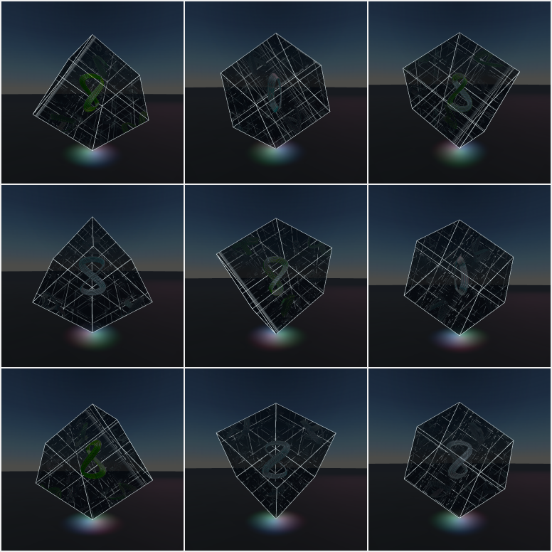
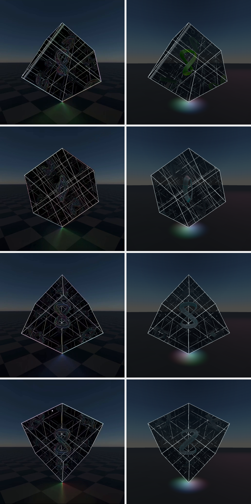

# Dave reconstruction evaluation

This report records the deterministic comparison used to accept the rebuilt
`/dave` scene. Ground-truth definitions and derivations are in
[`dave-ground-truth.md`](./dave-ground-truth.md).

## Final nine-anchor render

The comparison below alternates source reference (left) and final Three.js
render (right) for frames 0009, 0039, 0099, and 0219.

## Pixel comparison

Screenshots were produced at exactly 512×512 with device scale 1, through
`npm run evaluate:dave` on headless Chromium with SwiftShader (software
WebGL). `setSourceFrame()` converts each encoded recording frame to its
de-duplicated 25 fps source state, including frame 0240 at exactly 7.68 s.
Metrics are per RGB channel on the 0–255 scale. The cube ROI is
`x=60…451, y=70…444`; the stricter center ROI is `x=130…381, y=125…379`.

| Ref | Full MAE | Full RMSE | Cube MAE | Cube RMSE | Center MAE | Center RMSE |
| ---: | ---: | ---: | ---: | ---: | ---: | ---: |
| 0009 | 11.362 | 22.308 | 16.165 | 29.014 | 22.499 | 35.849 |
| 0039 | 12.228 | 25.088 | 17.830 | 32.874 | 25.891 | 41.939 |
| 0069 | 11.981 | 23.890 | 17.246 | 31.203 | 23.786 | 38.414 |
| 0099 | 10.870 | 22.018 | 15.331 | 28.670 | 20.962 | 35.328 |
| 0129 | 11.423 | 23.445 | 16.533 | 30.690 | 22.799 | 37.478 |
| 0159 | 11.602 | 23.684 | 16.709 | 30.926 | 23.692 | 38.034 |
| 0189 | 11.413 | 23.313 | 16.238 | 30.323 | 22.705 | 37.215 |
| 0219 | 10.477 | 21.244 | 14.834 | 27.618 | 20.634 | 33.908 |
| 0240 | 11.440 | 23.258 | 16.623 | 30.397 | 23.674 | 37.589 |
| **Mean** | **11.422** | **23.139** | **16.390** | **30.190** | **22.960** | **37.306** |

The full-frame mean absolute error is 4.48% of the channel range. Pixel error
is not allowed to overrule physics: a camera-facing hero or manually placed
copies fail even if blur or grading lowers their scalar score.

## What changed in this revision, and what the anchors said

Every change below was scored with the same harness on the same machine before
it was kept. The starting point is the previous commit rendered on this
machine; the earlier table in this file was produced on a different (GPU)
machine and is not directly comparable to any row here.

| Variant | Full MAE | Cube MAE | Center MAE | Decision |
| --- | ---: | ---: | ---: | --- |
| Previous commit, this machine | 16.655 | 20.249 | 24.642 | Baseline. Four anchors (0039, 0099, 0159, 0219) rendered fully black. |
| Blackout guard + flat seven-strand band, 0 half-twists, dark glass body | 12.169 | 16.941 | 22.896 | Kept the band and the guards. |
| Band with 1 half-twist (Möbius) | 12.203 | 17.001 | 23.039 | Within 1% of 0 and 2; selected on topology, not on score. |
| Band with 2 half-twists (one full twist) | 12.135 | 16.880 | 22.786 | Within 1% of 0 and 1. |
| Contact-emitter reach 2.2 → 1.5 | 11.602 | 16.330 | 22.819 | Kept: better on every ROI at every anchor. |
| Final: Möbius band + 1.5 reach, control hidden in QA | 11.422 | 16.390 | 22.960 | Shipped; table above. |
| Mirror reflectance 0.62 → 0.72, normal reflectance 0.50 → 0.60 | 13.426 | 19.182 | 27.410 | Rejected: worse on every ROI. The calibrated 0.62/0.50 stand. |

The twist ablation is the honest result for the band: the video cannot tell
zero, one, and two half-twists apart, so the one-sided Möbius band is the
selected hypothesis rather than a measurement.

## Source-model calibration

These numbers measure the reconstruction against annotated source landmarks;
they are not mislabeled as final-screenshot residuals.

| Calibration | Source result |
| --- | --- |
| Camera horizon sinusoid | 0.052 px RMS over the recovered source states |
| Projected cube shell | 1–2 px corner error at the calibrated anchors |
| Full-side mirror-cell law | 8.2 px RMS over 35 observations of seven cells across five frames |
| Rejected `side/3` copy lattice | 64.6 px RMS over the same observations |

## Runtime and structural gates

| Gate | Result |
| --- | --- |
| Source timing | Pass: exact encoded-frame → 25 fps state mapping; frame 0240 is 7.68 s |
| Root timing | Pass: `60.5° + 45°/s × t`, one exact eight-second period |
| Contact | Pass: QA state reports local `(-,-,-)` at world `(0,0,0)` at every anchor; no bob |
| Rigid dependency | Pass: band, frame, six coatings, panes, and body lights inherit one root; no child counter-rotation |
| Cable views | Pass: edge ovals at 0039/0159; face lobes at 0099/0219 |
| Cable hypothesis | Pass for selected fit: lifted `cos(q)` Gerono centerline, seven strands across one flat band, one half-twist (Möbius); 0/1/2 half-twists within 1% |
| Aluminium glass | Pass by material/state audit: `0.58` effective coating metalness over `IOR=1.47`, `0.42` transmitting glass, `0.052` roughness and clearcoat; dark `#3d474b` body |
| Numerical robustness | Pass: radiance capped at 48 before output; NaN/Inf environment and reflection samples zeroed; no black frame at any of the nine anchors or at 1.5 s / 7.0 s, which were black before |
| Self-reflection environment | Pass: source-centered half-float cube capture sees only attenuated unfolded self/frame images; the physical source is excluded, preventing read/write feedback |
| Spectral lanes | Pass: narrow Fresnel-weighted surface accents; QA asserts their phase equals `rootYaw/360`, with no independent animation clock |
| Mirror orientation | Pass: six inward `FrontSide` coatings plus separate smoky double-sided panes |
| Render history | Pass: frame 0099 is pixel-identical after different prior phases (0 changed pixels) |
| Mirror parity | Pass: `Translate(side*n) × diag((-1)^n)`; odd cells baked with reversed winding, even cells instanced |
| Total bounce energy | Pass: per-order shader multiplier attenuates diffuse, emissive, specular, clearcoat, and iridescence together |
| Finite clipping | Pass: stock oblique reflection clipping plus finite 0.9925-side apertures |
| Recursion | Pass: proxy inputs through order 12 plus the face bounce produce optically converged final order 13; the remaining infinite tail is below half an 8-bit display step |
| Source dependency | Pass by construction and QA toggles: each physical source family owns every derived image |
| Physical frame | Pass: one `EdgesGeometry` cage, exactly twelve source edges; no scaled duplicate cages |
| Fake geometry audit | Pass: no random copies, face grid, volume lattice, nested cage, fixed sparkles, or keyed rim animation |
| Static world | Pass: checker floor and equirectangular sky stay outside the rotating root |
| QA framing | Pass: the visitor auto-rotate control is not rendered in `?qa=1`, so nothing but the sculpture is scored |

## Build and runtime checks

- `npm run build:client`: pass.
- `npm run test:dave-glass`: pass; asserts the layered aluminium-glass
  constants, the four-tube Möbius band topology (three two-lap strand pairs
  plus the centre strand), the radiance ceiling and environment-sample
  guards, root-yaw uniform coupling, recursive-environment assignment,
  capture-feedback exclusion, shader injection, and post-shading attenuation
  in the first mirror proxy.
- `npm run evaluate:dave`: checked-in, dependency-light Chromium/CDP capture,
  state assertion, history-independence, source-dependency, responsive-layout,
  and pixel-metric harness. Set `DAVE_CHROMIUM` only if Chromium is not in a
  standard path or Playwright cache. `DAVE_QUERY="key=value"` appends a query
  string to the QA URL for A/B experiments. The scene wait allows two minutes
  because a software-WebGL first frame takes well over the old twelve seconds.
- `node scripts/dave-contact-sheet.mjs <evaluate-output-dir>` regenerates the
  two review images above from a run's captures.
- Deterministic WebGL captures: all nine anchors produced.
- Page/WebGL exceptions: none. The Vite-only capture harness reports two
  expected empty backend requests because it does not run the Express API.
- Portrait and landscape captures retain the selected source time on resize
  and do not clip the assembly.
- A canvas `ResizeObserver`, dynamic-viewport sizing, and a post-layout frame
  correction prevent the lazy route from retaining the browser's temporary
  300×150 canvas aspect when it opens in mobile Safari.
- The visitor camera uses a minimum `2.08 × side` radius plus an aspect-aware
  bounding-sphere fit with 18% tangent margin; deterministic QA keeps the
  calibrated `1.87 × side` source framing. Mirror targets adapt from 512–768 px
  and both reflection and half-float composition buffers use 4× multisampling
  where supported.
- Lazy `/dave` route, fixed-time mode, and legacy synthetic-30-fps `setFrame()`
  remain intact; canonical comparisons use `setSourceFrame()`.
- Full-repo `npm run check` still reports unrelated pre-existing TypeScript
  errors outside the Dave route; the Dave production bundle compiles cleanly.
