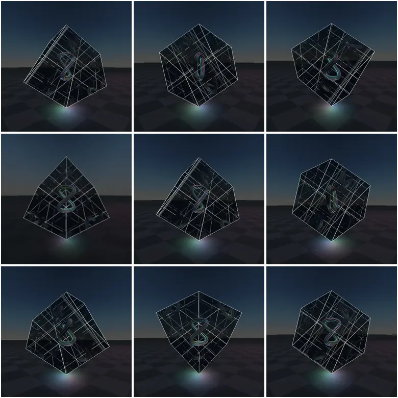
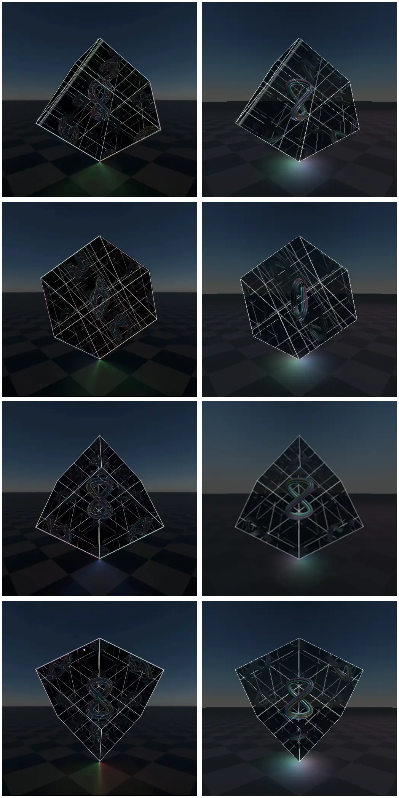

# Dave reconstruction evaluation

This report records the deterministic comparison used to accept the rebuilt
`/dave` scene. Ground-truth definitions and derivations are in
[`dave-ground-truth.md`](./dave-ground-truth.md).

## Final nine-anchor render

The comparison below alternates source reference (left) and final Three.js
render (right) for frames 0009, 0039, 0099, and 0219.

## Pixel comparison

Screenshots were produced at exactly 512×512 with device scale 1.
`setSourceFrame()` converts each encoded recording frame to its de-duplicated
25 fps source state, including frame 0240 at exactly 7.68 s. Metrics are per RGB
channel on the 0–255 scale. The cube ROI is `x=60…451, y=70…444`; the stricter
center ROI is `x=130…381, y=125…379`.

| Ref | Full MAE | Full RMSE | Cube MAE | Cube RMSE | Center MAE | Center RMSE |
| ---: | ---: | ---: | ---: | ---: | ---: | ---: |
| 0009 | 11.772 | 23.253 | 16.650 | 30.053 | 22.526 | 36.458 |
| 0039 | 12.279 | 25.197 | 17.895 | 32.929 | 25.152 | 41.079 |
| 0069 | 12.168 | 24.133 | 17.554 | 31.446 | 23.516 | 37.977 |
| 0099 | 11.207 | 22.887 | 15.872 | 29.742 | 21.101 | 35.768 |
| 0129 | 11.849 | 24.073 | 17.205 | 31.394 | 23.203 | 37.811 |
| 0159 | 12.212 | 24.779 | 17.460 | 32.096 | 24.656 | 39.381 |
| 0189 | 11.885 | 24.286 | 16.700 | 31.265 | 22.996 | 37.995 |
| 0219 | 11.077 | 22.562 | 15.653 | 29.127 | 21.520 | 35.503 |
| 0240 | 12.096 | 24.631 | 17.586 | 32.041 | 24.921 | 39.723 |
| **Mean** | **11.838** | **23.978** | **16.953** | **31.121** | **23.288** | **37.966** |

The full-frame mean absolute error is 4.64% of the channel range. It rose from
the decorative predecessor when the fake copy field was removed and physically
valid inward mirrors/parity were enforced. Pixel error is therefore not allowed
to overrule physics: a camera-facing hero or manually placed copies fail even
if blur or grading lowers their scalar score.

## Source-model calibration

These numbers measure the reconstruction against annotated source landmarks;
they are not mislabeled as final-screenshot residuals.

| Calibration | Source result |
| --- | --- |
| Camera horizon sinusoid | 0.052 px RMS over the recovered source states |
| Projected cube shell | 1–2 px corner error at the calibrated anchors |
| Full-side mirror-cell law | 8.2 px RMS over 35 observations of seven cells across five frames |
| Rejected `side/3` copy lattice | 64.6 px RMS over the same observations |

## Runtime and structural gates

| Gate | Result |
| --- | --- |
| Source timing | Pass: exact encoded-frame → 25 fps state mapping; frame 0240 is 7.68 s |
| Root timing | Pass: `60.5° + 45°/s × t`, one exact eight-second period |
| Contact | Pass: QA state reports local `(-,-,-)` at world `(0,0,0)` at every anchor; no bob |
| Rigid dependency | Pass: cable, frame, six coatings, panes, and body lights inherit one root; no child counter-rotation |
| Cable views | Pass: edge ovals at 0039/0159; face lobes at 0099/0219 |
| Cable hypothesis | Pass for selected fit: lifted `cos(q)` Gerono centerline, seven physical strands, one twist |
| Mirror orientation | Pass: six inward `FrontSide` coatings plus separate smoky double-sided panes |
| Render history | Pass: frame 0099 is pixel-identical after different prior phases (0 changed pixels) |
| Mirror parity | Pass: `Translate(side*n) × diag((-1)^n)`; odd cells baked with reversed winding, even cells instanced |
| Total bounce energy | Pass: per-order shader multiplier attenuates diffuse, emissive, specular, clearcoat, and iridescence together |
| Finite clipping | Pass: stock oblique reflection clipping plus finite 0.9925-side apertures |
| Recursion | Pass: proxy inputs 3/5 plus the face bounce produce final cable/frame orders 4/6 |
| Source dependency | Pass by construction and QA toggles: each physical source family owns every derived image |
| Physical frame | Pass: one `EdgesGeometry` cage, exactly twelve source edges; no scaled duplicate cages |
| Fake geometry audit | Pass: no random copies, face grid, volume lattice, nested cage, fixed sparkles, or keyed rim animation |
| Static world | Pass: checker floor and equirectangular sky stay outside the rotating root |

## Build and runtime checks

- `npm run build:client`: pass.
- `npm run evaluate:dave`: checked-in, dependency-light Chromium/CDP capture,
  state assertion, history-independence, source-dependency, responsive-layout,
  and pixel-metric harness. Set `DAVE_CHROMIUM` only if Chromium is not in a
  standard path or Playwright cache.
- Deterministic WebGL captures: all nine anchors produced.
- Page/WebGL exceptions: none. The Vite-only capture harness reports two
  expected empty backend requests because it does not run the Express API.
- Software-WebGL frame submission: median 2.9 ms and p95 3.9 ms in the final
  short sample. This is CPU submission timing, not GPU completion; browser and
  device performance remain device-specific.
- Portrait and landscape captures retain the selected source time on resize
  and do not clip the assembly.
- Lazy `/dave` route, fixed-time mode, and legacy synthetic-30-fps `setFrame()`
  remain intact; canonical comparisons use `setSourceFrame()`.
- Full-repo `npm run check` still reports unrelated pre-existing TypeScript
  errors outside the Dave route; the Dave production bundle compiles cleanly.
