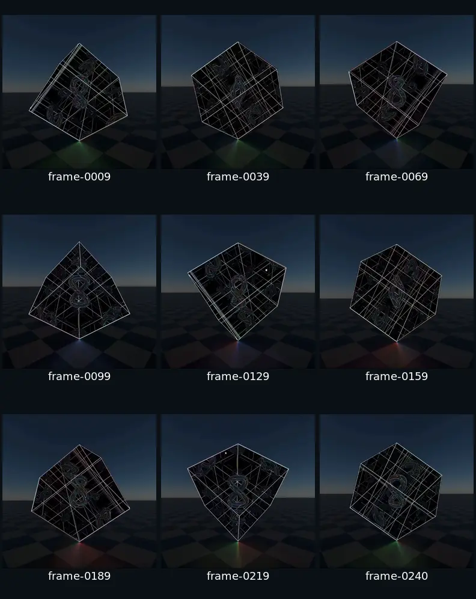
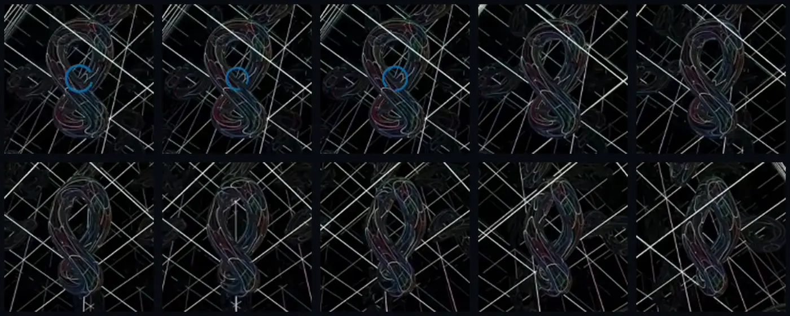
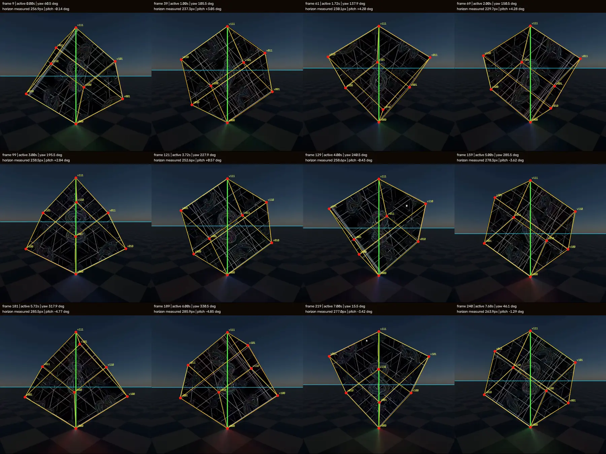
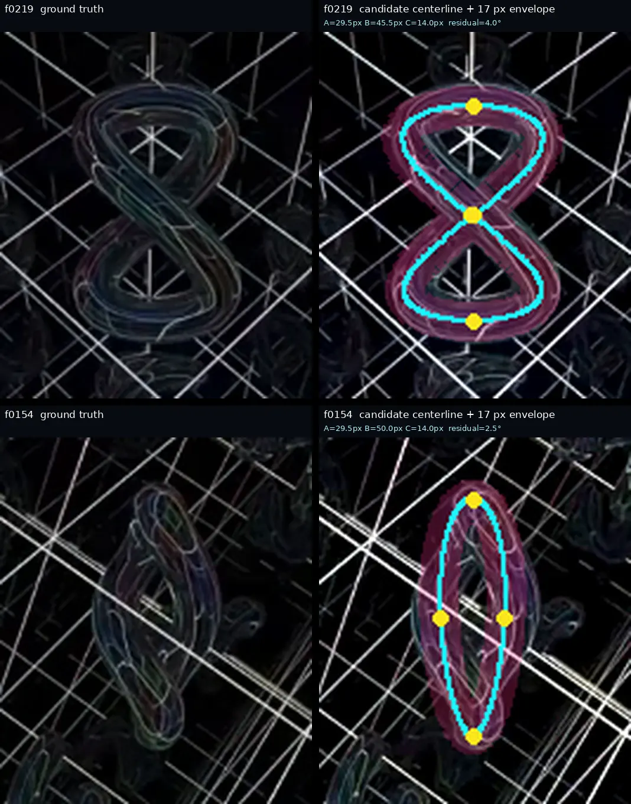
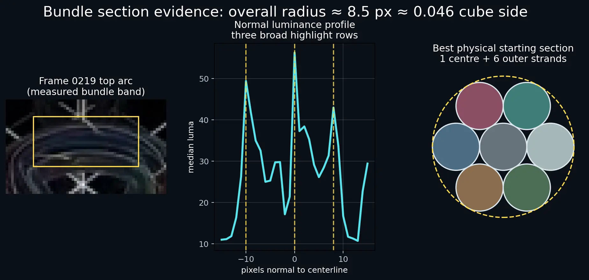
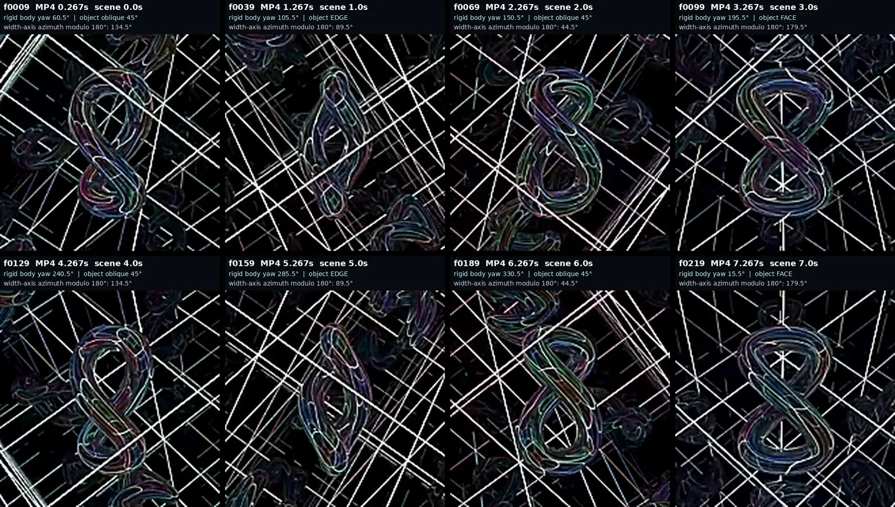
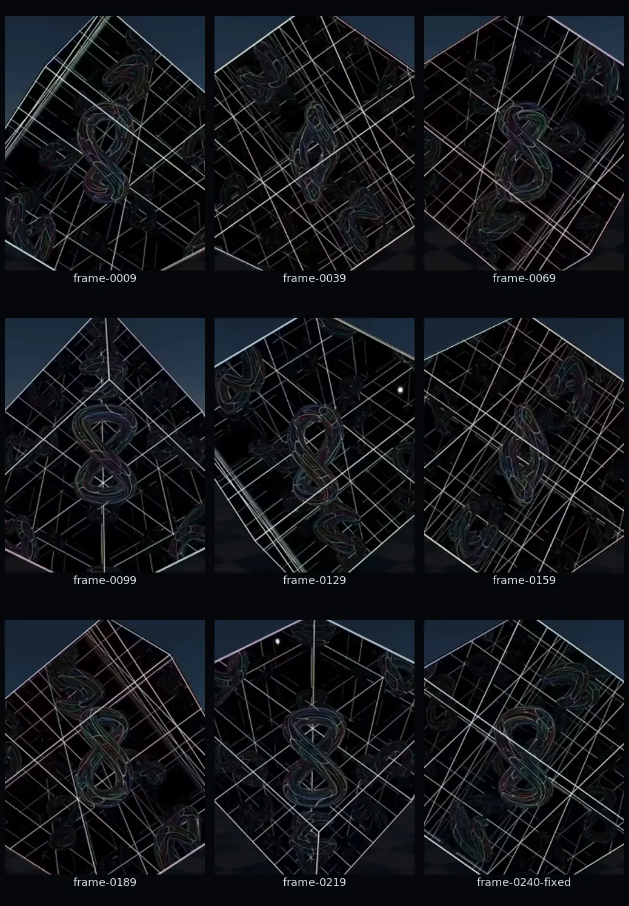
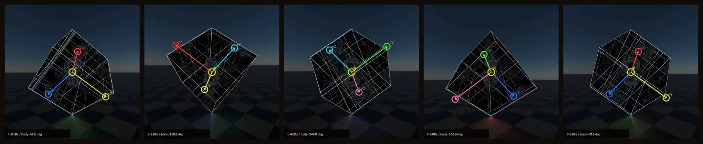
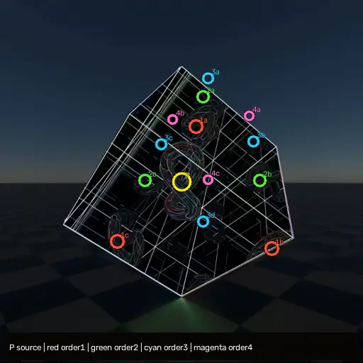

# Dave mirror sculpture: video ground truth

This is the acceptance specification for `/dave`. It was rebuilt from the
uploaded recording, not inferred from the previous Three.js scene. Exact
512×512 source crops and annotated measurements are stored beside this file in
[`docs/dave-reference`](./dave-reference).



## Source, cadence, and clean time origin

- Source: `ScreenRecording_08-31-2026 18-52-11_1.mp4`.
- Stream: H.264, 512×1112, nominal 30 fps, 248 frames, 8.266667 seconds.
- Scene crop: source `(x=0, y=278, width=512, height=512)`.
- The underlying render is an eight-second, 200-state loop at 25 fps. The
  screen recorder duplicates every sixth source state to make a 30 fps stream.
- Frames 1–8 hold previous-loop state 199 under a blue loading spinner. That
  spinner stays screen-centered and never appears in a mirror; it is UI, not
  sculpture geometry.
- Frame 9 is clean state 0 and the active-time origin. Frames 241–248 are a
  recorder hold of state 192; states 193–198 are reconstructed periodically.

For clean recording frame `n=9…240`:

```text
state u = n - 9 - floor((n - 5) / 6)
active time t = u / 25 seconds
```



## Canonical times, angles, and observed views

The fitted Three.js root angle is `60.5° + 45°/s × t`. Relative yaw is included
to make one-second comparisons easy.

| Ref frame | Video time | Source state | Active time | Absolute root yaw | Relative yaw | Physical cable view | Horizon Y |
| ---: | ---: | ---: | ---: | ---: | ---: | --- | ---: |
| 0009 | 0.267 s | 0 | 0.00 s | 60.5° | 0° | oblique | 256.89 px |
| 0039 | 1.267 s | 25 | 1.00 s | 105.5° | 45° | edge/open oval | 237.25 px |
| 0069 | 2.267 s | 50 | 2.00 s | 150.5° | 90° | oblique | 229.63 px |
| 0099 | 3.267 s | 75 | 3.00 s | 195.5° | 135° | face/two lobes | 238.50 px |
| 0129 | 4.267 s | 100 | 4.00 s | 240.5° | 180° | opposite oblique | 258.65 px |
| 0159 | 5.267 s | 125 | 5.00 s | 285.5° | 225° | opposite edge/open oval | 278.29 px |
| 0189 | 6.267 s | 150 | 6.00 s | 330.5° | 270° | oblique | 285.91 px |
| 0219 | 7.267 s | 175 | 7.00 s | 15.5° | 315° | opposite face/two lobes | 277.05 px |
| 0240 | 7.967 s | 192 | 7.68 s | 46.1° | 345.6° | near-loop oblique | 263.92 px |



## One rigid physical assembly

The outer frame, all six mirror substrates, the central seven-filament glass form,
and any body-mounted emitters are one rigid object. No child billboards,
counter-rotates, bobs, or receives an independent phase.

The cube balances on the local body diagonal from `(-,-,-)` to `(+,+,+)`.
The fixed minimum rotation maps local `(1,1,1)/sqrt(3)` to world `+Y`; the full
assembly then turns around that same world axis:

```text
theta(t) = radians(60.5 + 45*t)
Mroot(t) = Translate(0, sqrt(3)*side/2, 0)
         * RotateWorldY(theta(t))
         * Align((1,1,1)/sqrt(3), world +Y)
```

For `side=3.3`, the cube center is exactly `sqrt(3)*side/2`. The bottom vertex
therefore stays at ground `y=0`; there is no `+0.08` visual lift and no root
sinusoid. The floor and sky remain world-static.

The previous `/dave` implementation violated the source in two hard ways:

1. it applied `-theta(t)` to the hero, holding it camera-facing;
2. it placed 26 small meshes inside the cube with arbitrary Euler rotations.

Both mechanisms have been removed. The face/edge/face progression above is the
regression proof that the cable now co-rotates with the enclosure.

## Camera and projected shell

At a square 512 px viewport:

| Parameter | Reconstructed value |
| --- | ---: |
| Vertical FOV | 72° |
| Focal length | 352.354 px |
| Camera radius from cube center | `1.87 × side = 6.171` |
| Principal point | `(256,256)` px |
| Roll | 0° |

FOV and radius are covariant; a direct all-corner alternative is
`73.73° / 1.822 × side`, but the stable vanishing-point fit above keeps the
shell within 1–2 px and is used by the implementation.

The interactive visitor view starts at a minimum `2.08 × side` radius, then
fits the cube's full bounding sphere against the tighter horizontal/vertical
field with an additional 18% tangent margin. Portrait phones therefore pull
back farther automatically instead of clipping the shell. QA/reference URLs
retain the calibrated `1.87 × side` radius so the source comparison remains
unchanged.

The lazy route observes the rendered canvas itself rather than relying only on
`window.resize`. This is required on mobile Safari: the Three.js scene can be
constructed while the lazy CSS still leaves the canvas at its 300×150 default,
and the later portrait layout does not necessarily emit a window resize. A
`ResizeObserver`, `100dvh`/`100dvw`, Visual Viewport resize listener, and a
post-layout frame correction keep projection and drawing-buffer aspect aligned.

The exact periodic horizon fit, with state `u=0…199`, is:

```text
horizonY(u) = 257.772441
            - 0.881122*cos(2*pi*u/200)
            - 28.141425*sin(2*pi*u/200)
```

Its measured RMS error is 0.052 px. The corresponding camera elevation is:

```text
cameraHeight/side = -0.00940652
                  + 0.14894964*sin(2*pi*t/8 + 0.03130027)
cameraZ = sqrt((1.87*side)^2 - cameraHeight^2)
camera.lookAt(cubeCenter)
```

At frame 0009, the recovered axis vertices are top `(256.0,93.0)` and ground
contact `(256.0,419.4)`. The six other projected corners are `(414.2,334.0)`,
`(88.1,317.5)`, `(189.3,161.2)`, `(283.1,294.5)`, `(388.7,207.4)`, and
`(172.0,214.6)`.

## The one physical cable

The centerline is a lifted Gerono lemniscate, not a flat path, trefoil, or
`cos(2q)` self-intersection:

```text
p(q) = 0.52*sin(2q)*eX + 0.82*sin(q)*eY + 0.245*cos(q)*eZ

eX = normalize( 1,-1, 0)
eY = normalize( 1, 1, 1)   // body diagonal / long axis
eZ = normalize(-1,-1, 2)   // eX cross eY
```

The `cos(q)` depth term separates the two apparent crossing branches and gives
the narrow open ellipse visible at frames 0039 and 0159. `B/A=1.58` and
`C/A=0.47` are within the independently fitted source ranges.



The best-supported visible-section reconstruction is a physical seven-filament
hex bundle in reflective glass. The centerline and bundle envelope are directly
constrained; seven filaments and one full twist are the best fit to the
cross-section/contour evidence, but are not uniquely identifiable from the
tone-mapped 512 px video:

- one center strand plus six equally spaced outer strands;
- strand radius approximately `0.05` scene units;
- outer-strand center ring radius approximately `0.10`;
- total bundle radius approximately `0.150`;
- one slow closed twist around the full lemniscate (the selected starting fit;
  zero and two turns are the nearest plausible ablations);
- a neutral smoky glass body on every filament, rather than seven opaque
  silver/teal/rose/blue/amber/green cables;
- narrow silver, teal, rose, slate blue, amber, and green surface-response
  lanes that sit over the transmitted body;
- rounded `TubeGeometry`, volume transmission, clearcoat/specular response,
  and no one-pixel line geometry on the directly viewed object.

The directly viewed strands use 256 centerline samples and 12 radial segments.
Near reflection proxies use the identical analytic curves/radii at 96×6
tessellation. Beyond order four, where tubes are sub-pixel, the same curves are
sampled as 20-segment strand traces. This retains the image path while avoiding
millions of unresolved tube vertices.





## Glass volume and traveling spectral lanes

The later close inspection changes the material interpretation, not the fitted
lemniscate geometry. Across the clean anchors, most of each filament is dark,
neutral, and partially transmitting. Bright mirror-frame paths and neighboring
filament contours remain visible through the bundle. Its pale double rims are
specular/refraction boundaries. The cyan, green, rose, blue, and gold marks are
much narrower than a filament and change their longitudinal position as root
yaw advances; they are surface reflections/interference lanes, not base-color
fills.



| Source anchor | Active time / yaw | Material evidence |
| --- | --- | --- |
| 0009 | 0.00 s / 60.5° | Nearly black transmitted core, silver double rim, short cyan/rose peaks on the lower loop |
| 0039 | 1.00 s / 105.5° | Edge view compresses the glass volume while teal and blue lanes run along the open oval |
| 0099 | 3.00 s / 195.5° | Broad face view exposes pale transparent gaps between filaments; colored lanes occupy only portions of each lobe |
| 0129 | 4.00 s / 240.5° | Rose/gold peaks have moved to different contour sections while the same rigid geometry remains |
| 0159 | 5.00 s / 285.5° | Opposite edge view again produces thin bright rims rather than opaque colored rods |
| 0219 | 7.00 s / 15.5° | Opposite face view retains a neutral body with teal/rose accents in new screen positions |

The runtime therefore models a thin sputtered-aluminium coating over a real
glass volume. Bulk aluminium is opaque; this is an effective layered fit for a
partially transmitting metallic coating, not a claim that solid aluminium
transmits light:

| Property | Runtime value |
| --- | ---: |
| Effective coating metalness | `0.58` |
| Roughness | `0.052` |
| Glass-substrate transmission | `0.42` |
| Thickness | `0.13` scene units |
| IOR | `1.47` |
| Attenuation distance | `0.62` scene units |
| Clearcoat / clearcoat roughness | `1.0 / 0.022` |
| Recursive environment intensity | `2.15` |
| Iridescence / iridescence IOR | `0.18 / 1.34` |

The static world environment now contributes to the glass BRDF, so orbiting the
camera changes real view-dependent reflections. A restrained procedural term
models the unresolved thin spectral lanes. For tube UV `(u,v)`, strand offset
`o`, and rigid root turns `phi = rootYaw/(2*pi)`:

```text
path pulse = cos(2*pi * (5*u - 1.25*phi + o))
rail roll  = fract(v + 0.115*sin(2*pi*(2*u+o)) - 0.18*phi + o)
```

Only a narrow rail near the center of `rail roll` receives the strand's accent,
and it is weighted by a Fresnel term. The values `5`, `1.25`, and `0.18` are a
calibrated perceptual fit to the compressed anchors, not uniquely measurable
material constants. Crucially, `phi` comes from the root transform rather than
wall-clock time: switching auto-rotate off freezes the lanes exactly with the
sculpture, while manual camera orbit still changes physical reflection angles.
The same shader is composed into the full-geometry mirror proxies before
per-bounce attenuation, so colored energy cannot remain bright at deep orders.

### Reflections of its own recursive reflections

A static sky environment cannot make the central form reflect the mirror room.
The direct aluminium-glass filaments now sample a live cube environment captured
at the physical source center. Its six 90° cameras see only render layer 2: the
twelve non-reflective physical frame edges plus the mathematically unfolded
cable and frame images through input order 12. They do not see the physical
glass source, mirror coatings, smoky panes, floor, or main camera.
This separation is the feedback guard: no material ever samples the cube target
while that same material is being drawn into it.

The resulting optical chain is:

```text
attenuated self-images orders 1…12
  -> 256/384 px half-float cube environment
  -> aluminium-glass surface reflection
  -> physical planar-mirror reflection
  -> displayed reflected object containing its reflected self-images
```

The unfolded input already converges below the 8-bit visibility threshold, so
the cube capture adds a surface-reflection stage without inventing a new copy
field or an uncontrolled render-target recursion. Deterministic `renderAt()`
calls refresh all six cube faces for every source anchor. During auto-rotate the
map refreshes each 3° of root yaw (15 updates per second at the measured 45°/s),
halving the additional capture rate while retaining mipmapped 256 px mobile and
384 px large-viewport targets. Camera orbit does not require a recapture: the
room and object are still, while the physical BRDF changes with the view vector.

## Six physical mirrors and recursive virtual images

There are exactly six physical mirror planes at cube-local
`x/y/z = +/-side/2`. There is no face subdivision grid, volume lattice, nested
cage, or 3×3×3 physical knot field. The dense straight-line field is the
recursive image of the twelve physical outer-frame edges. Every surrounding
knot is an image of the one center cable.

`PlaneGeometry` has local normal `+Z`; the inward coating poses are therefore:

| Face center | Inward normal | Three.js Euler `(x,y,z)` |
| --- | --- | --- |
| `(0,0,+h)` | `-Z` | `(0,pi,0)` |
| `(0,0,-h)` | `+Z` | `(0,0,0)` |
| `(+h,0,0)` | `-X` | `(0,-pi/2,0)` |
| `(-h,0,0)` | `+X` | `(0,+pi/2,0)` |
| `(0,+h,0)` | `-Y` | `(+pi/2,0,0)` |
| `(0,-h,0)` | `+Y` | `(-pi/2,0,0)` |

This orientation is not cosmetic. It makes the far/side interior coatings
reflect the physical source and lets camera-near back faces transmit it. An
outward or forced-double-sided `Reflector` clips the centered source and can
display a stale render target.

For an integer unfolded mirror cell `n=(nx,ny,nz)`:

```text
p_n = side*n + D_n*p
D_n = diag((-1)^nx, (-1)^ny, (-1)^nz)
I_n = Translate(side*n) * D_n * Ophysical
minimum bounce count N = |nx| + |ny| + |nz|
```

Odd `N` has determinant `-1` and reverses handedness. Even `N` is proper.
There is no authored image rotation or scale; apparent size is virtual depth
plus camera perspective. Optimizing cell spacing against 35 observations of
seven tracked cells across five frames gives `1.001 × side`. The old `side/3`
copy lattice misses those observations by 64.6 px RMS; the full-side mirror
model fits them at 8.2 px RMS.





The render uses actual finite, inward-facing `Reflector` coatings with oblique
clipping, separate double-sided smoky transmission panes, and mathematically
equivalent unfolded image cells. A literal infinity cannot be submitted to a
finite GPU, so the unfolded series continues through input order 12. With the
measured/calibrated reflectance of `0.62`, the next reflected contribution is
below half of one 8-bit display step at normal incidence; the omitted infinite
tail is therefore optically converged rather than visibly truncated. The
physical source in a face reflection is optical order one:

- cable input proxies through order 12 (2,624 proxies plus the physical
  source), producing final reflected orders 1–13; orders 1–4 use tube geometry
  and orders 5–12 use sub-pixel curve traces;
- frame-edge input proxies through order 12 (2,624 proxies plus the physical
  twelve-edge frame), producing final reflected orders 1–13;
- negative-determinant transforms retained;
- odd-parity cable cells are baked with reversed triangle winding because
  Three.js does not support negative-scale `InstancedMesh` matrices;
- closed glass tubes use their outward `FrontSide` boundary; the winding fix
  keeps odd mirror images front-facing without a glitch-prone double pass;
- recursive proxies visible only to the six reflection cameras;
- all other mirrors hidden during each reflection pass, preventing an
  uncontrolled render-target recursion loop;
- all reflection planes and cell coordinates inherit the same rigid root;
- every reflective coating faces inward; camera-near panels transmit the
  direct physical object while the inward far/side coatings reflect it.

Reflection targets adapt from 512 to 768 px by viewport size and use 4× MSAA.
The half-float post-processing buffers are also 4× multisampled where supported,
which removes the earlier stair-stepping on frame edges and fine reflections.

## Mirror optics

Measured/composited starting values from blank panels and first-order images:

| Optical property | Source estimate / calibrated runtime value |
| --- | ---: |
| Blank-panel normal transmission estimate | `T ≈ 0.14` |
| Separate smoky-pane display opacity | `0.18` |
| Per-bounce image multiplier | `R ≈ 0.62` |
| Final panel normal reflectance | `0.50` after display-composite calibration |
| Bounce tint | `(0.96,0.98,1.00)` |
| Dark substrate | approximately `#03050a` |
| Source-estimated effective roughness | `0.04–0.09` |
| Fresnel normal term | `0.30–0.40` observed; Schlick rise at grazing angles |

The mirror shader combines the clipped reflection texture with a separate smoky
transmission pane and a Schlick-like response that rises from 0.50 at normal
incidence. The pre-composite first-bounce estimate is 0.55–0.70; 0.55 matches
the recorded display after panel tint and final color conversion. There is no
invented microfacet-roughness control in the planar shader: the observed
effective softness is approximated by a 384 px reflection target before the
final bloom pass.

White starbursts are view-dependent specular events. They are not fixed point
sprites: in frames 0206–0210 one glint moves about 51 px while its adjacent
physical rim moves about 8 px. The physical materials and reflection cameras
therefore generate highlights first; bloom is applied afterward.

## Static world and contact light

- Charcoal checkerboard, rotated 45° relative to the camera.
- Cool navy 2:1 equirectangular sky transitioning through warm gray at the
  horizon; it is world-oriented, not a phase-scrolled screen texture.
- Fixed world floor and sky while the assembly rotates.
- Three body-mounted colored point emitters rotate rigidly near the grounded
  vertex and light a physical rough floor. This is a real-time contact-light
  approximation, explicitly not a spectral/refraction caustic solver.
- No hard cast shadow and no rotating checkerboard.

## Evaluation gates

The nine canonical frames are rendered deterministically through
`window.__DAVE_QA__.setSourceFrame()` (which applies the recorder de-duplication
formula above) and compared with the exact crops.

Geometry:

- absolute root-angle error below 1° at every anchor;
- horizon error below 1 px;
- projected shell vertices below 6 px, with top/contact below 3 px;
- exact edge/open-oval views at frames 0039/0159 and face/two-lobe views at
  0099/0219;
- no contact-vertex motion and no child phase cancellation.

Mirror dependency tests:

- disabling the cable source family removes the physical cable and every image
  derived from it;
- disabling the twelve-edge frame source family removes the physical frame and
  the apparent interior line field derived from it;
- odd image cells reverse handedness and even cells do not;
- images remain clipped to finite mirror apertures and never leak outside the
  cube;
- the full optical state returns after eight seconds without accumulated drift.

Release:

- no random copy transforms, fake face grids, nested cages, fixed sparkles, or
  screen-facing hero transform;
- square, portrait, and landscape layouts do not clip;
- production client build passes;
- deterministic nine-anchor capture completes without page or WebGL errors.

The final anchor renders, per-frame pixel metrics, and gate results are recorded
in [`dave-evaluation.md`](./dave-evaluation.md).
